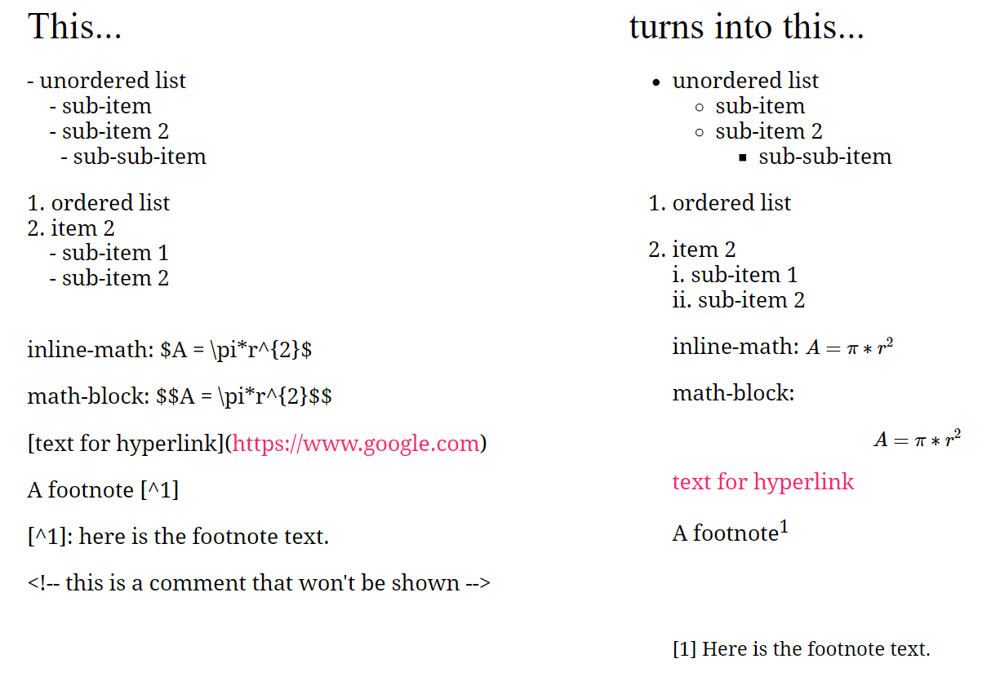

# Rmarkdown Demo Chat with PhDs

Why Rmarkdown?
--------------

-   Code, results, and text in the same document
-   Your results and plots are automatically generated from your data,
    so your documents can be easily updated if your data changes
-   Outputs can be directly deployed online
    -   Integrates nicely with GitHub Pages and other hosting services
-   Reproducible Workflow - from raw data over analysis to presentation

YAML Header
-----------

A YAML header is a set of key-value pairs at the start of your file. The
YAML header includes meta-information about your Rmarkdown document. For
example whether the output should be an HTML or a PDF document. Begin
and end the header with a line of three dashes (- - -)

    ---
    title: "Rmarkdown Workshop"
    subtitle: "A basic Introduction"
    author: "Fabio Votta"
    output: html_document
    ---

### Possible outputs:

-   output: html\_document
-   output: pdf\_document
-   output: word\_document
-   output: beamer\_presentation
-   output: ioslides\_presentation

Rmarkdown Syntax
----------------

**CODING EXAMPLE**

*italics* and **bold**

`inline code`

sub2/superscript2

<s>strikethrough</s>

escaped: \* \_ \\

endash: –, emdash: —

> blockquote

Header 1
========

Header 2
--------

Line break: End line with 2+ spaces, or backslash: Roses are red Violets
are blue

Roses are red  
Violets are blue

**CODING EXAMPLE**

This… - unordered list - sub-item - sub-item 2 - sub-sub-item

1.  ordered list
2.  item 2
    -   sub-item 1
    -   sub-item 2

inline-math: *A* = *π* \* *r*2

math-block:
*A* = *π* \* *r*2

[text for hyperlink](https://www.google.com)

A footnote [1]

<!-- this is a comment that won't be shown -->

Introducing a Code Chunk
------------------------

### A Special Kind of Chunk

In a setup chunk, one usually sets global options for the entire
document.

Normally, an R Markdown document starts with this chunk.

`knitr::opts_chunk$set` sets default options for all chunks.

    ## Sets Global Options
    knitr::opts_chunk$set(echo = T, warning = F, message = F)

<table>
<thead>
<tr class="header">
<th>option</th>
<th>default</th>
<th>effect</th>
</tr>
</thead>
<tbody>
<tr class="odd">
<td>eval</td>
<td>TRUE</td>
<td>Whether to evaluate the code and include its results</td>
</tr>
<tr class="even">
<td>echo</td>
<td>TRUE</td>
<td>Whether to display code along with its results</td>
</tr>
<tr class="odd">
<td>warning</td>
<td>TRUE</td>
<td>Whether to display warnings</td>
</tr>
<tr class="even">
<td>error</td>
<td>FALSE</td>
<td>Whether to display errors</td>
</tr>
<tr class="odd">
<td>message</td>
<td>TRUE</td>
<td>Whether to display messages</td>
</tr>
<tr class="even">
<td>tidy</td>
<td>FALSE</td>
<td>Whether to reformat code in a tidy way when displaying it</td>
</tr>
<tr class="odd">
<td>results</td>
<td>“markup”</td>
<td>“markup”, “asis”, “hold”, or “hide”</td>
</tr>
<tr class="even">
<td>cache</td>
<td>FALSE</td>
<td>Whether to cache results for future renders</td>
</tr>
<tr class="odd">
<td>comment</td>
<td>“##”</td>
<td>Comment character to preface results with</td>
</tr>
<tr class="even">
<td>fig.width</td>
<td>7</td>
<td>Width in inches for plots created in chunk</td>
</tr>
<tr class="odd">
<td>fig.height</td>
<td>7</td>
<td>Height in inches for plots created in chunk</td>
</tr>
</tbody>
</table>

Including Tables
----------------

    cars %>% 
      head() %>% 
      knitr::kable()

<table>
<thead>
<tr class="header">
<th style="text-align: right;">speed</th>
<th style="text-align: right;">dist</th>
</tr>
</thead>
<tbody>
<tr class="odd">
<td style="text-align: right;">4</td>
<td style="text-align: right;">2</td>
</tr>
<tr class="even">
<td style="text-align: right;">4</td>
<td style="text-align: right;">10</td>
</tr>
<tr class="odd">
<td style="text-align: right;">7</td>
<td style="text-align: right;">4</td>
</tr>
<tr class="even">
<td style="text-align: right;">7</td>
<td style="text-align: right;">22</td>
</tr>
<tr class="odd">
<td style="text-align: right;">8</td>
<td style="text-align: right;">16</td>
</tr>
<tr class="even">
<td style="text-align: right;">9</td>
<td style="text-align: right;">10</td>
</tr>
</tbody>
</table>

The `kable` function within `knitr` produces neat tables out of
dataframes. A number of other packages are available for making pretty
tables, see [rmarkdown.rstudio.com](rmarkdown.rstudio.com).

    result <- 4 + 4

Inside your text you can include code with the syntax 8.

<!-- For example, "r 4 + 4" would output 8 in your text. -->

Links for futher learning:
==========================

-   [RMarkdown for writing reproducible scientific
    papers](https://libscie.github.io/rmarkdown-workshop/handout.html)
-   [Intro to Rmarkdown by
    Rstudio](https://rmarkdown.rstudio.com/lesson-1.html)
-   [Rmarkdown
    Cheatsheet](https://rstudio.com/wp-content/uploads/2015/02/rmarkdown-cheatsheet.pdf)
-   [Advanced Rmarkdown Workshop](https://arm.rbind.io/)
-   [R Markdown: The Definitive Guide (Yihui Xie, J. J. Allaire, Garrett
    Grolemund)](https://bookdown.org/yihui/rmarkdown/)
-   [Writing Reproducible Research Papers with R
    Markdown](https://resulumit.com/teaching/rmd_workshop.html)
-   [Starting R markdown (YouTube Intro series with the magnificent
    Danielle Navarro)](https://www.youtube.com/watch?v=tuFn-sFSVgk)

[1] here is the footnote text.
