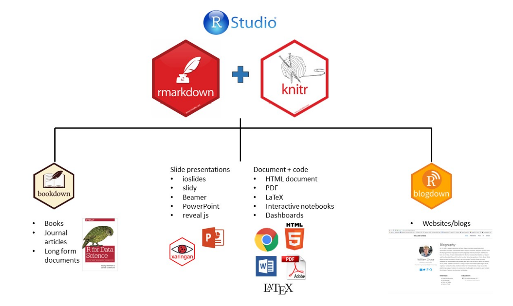

# This is the beginning


## Why Rmarkdown?

+ Code, results, and text in the same document
+ Your results and plots are automatically generated from your data, so your documents can be easily updated if your data changes
+ Outputs can be directly deployed online
   + Integrates nicely with GitHub Pages and other hosting services
+ Reproducible Workflow - from raw data over analysis to presentation




## YAML Header

A YAML header is a set of key-value pairs at the start of your file. 
The YAML header includes meta-information about your Rmarkdown document.
For example whether the output should be an HTML or a PDF document.
Begin and end the header with a line of three dashes (- - -)

```{r, eval=F}
---
title: "Rmarkdown Workshop"
subtitle: "A basic Introduction"
author: "Fabio Votta"
output: html_document
---

```


### Possible outputs:

+ output: html_document
+ output: pdf_document
+ output: word_document
+ output: beamer_presentation
+ output: ioslides_presentation


## Rmarkdown Syntax


**CODING EXAMPLE**

*italics* and **bold**

`inline code`

sub~2~/superscript^2^

~~strikethrough~~

escaped: \* \_ \\

endash: --, emdash: ---

> blockquote

# Header 1

## Header 2

Line break: End line with 2+ spaces, or backslash:
Roses are red
Violets are blue

Roses are red \
Violets are blue


**CODING EXAMPLE**

This...
- unordered list
    - sub-item
    - sub-item 2
      - sub-sub-item

1. ordered list
2. item 2
    - sub-item 1
    - sub-item 2


inline-math: $A = \pi*r^{2}$

math-block: $$A = \pi*r^{2}$$

[text for hyperlink](https://www.google.com)

A footnote [^1]

[^1]: here is the footnote text.

<!-- this is a comment that won't be shown -->

## Introducing a Code Chunk


### A Special Kind of Chunk

In a setup chunk, one usually sets global options for the entire document.

Normally, an R Markdown document starts with this chunk.

`knitr::opts_chunk$set` sets default options for all chunks.

```{r setup}
library(tidyverse)

## Sets Global Options
knitr::opts_chunk$set(echo = T, warning = F, message = F)


```

option       | default      | effect 
-------------| -------------|-------------
eval         | TRUE         | Whether to evaluate the code and include its results
echo         | TRUE         | Whether to display code along with its results
warning      | TRUE         | Whether to display warnings
error        | FALSE        | Whether to display errors
message      | TRUE         | Whether to display messages
tidy         | FALSE        | Whether to reformat code in a tidy way when displaying it
results      | "markup"     | "markup", "asis", "hold", or "hide"
cache        | FALSE        | Whether to cache results for future renders
comment      | "##"         | Comment character to preface results with
fig.width    | 7            | Width in inches for plots created in chunk
fig.height   | 7            | Height in inches for plots created in chunk


## Including Tables

```{r}
cars %>% 
  head() %>% 
  knitr::kable()


```

The `kable` function within `knitr` produces neat tables out of dataframes.
A number of other packages are available for making pretty tables, see [rmarkdown.rstudio.com](rmarkdown.rstudio.com).

```{r}
result <- 4 + 4
```


Inside your text you can include code with the syntax `r result`.

<!-- For example, "r 4 + 4" would output 8 in your text. -->


# Links for futher learning:

+ [RMarkdown for writing reproducible scientific papers](https://libscie.github.io/rmarkdown-workshop/handout.html)
+ [Intro to Rmarkdown by Rstudio](https://rmarkdown.rstudio.com/lesson-1.html)
+ [Rmarkdown Cheatsheet](https://rstudio.com/wp-content/uploads/2015/02/rmarkdown-cheatsheet.pdf)
+ [Advanced Rmarkdown Workshop](https://arm.rbind.io/)
+ [R Markdown: The Definitive Guide (Yihui Xie, J. J. Allaire, Garrett Grolemund)](https://bookdown.org/yihui/rmarkdown/)
+ [Writing Reproducible Research Papers with R Markdown](https://resulumit.com/teaching/rmd_workshop.html)
+ [Starting R markdown (YouTube Intro series with the magnificent Danielle Navarro)](https://www.youtube.com/watch?v=tuFn-sFSVgk)
